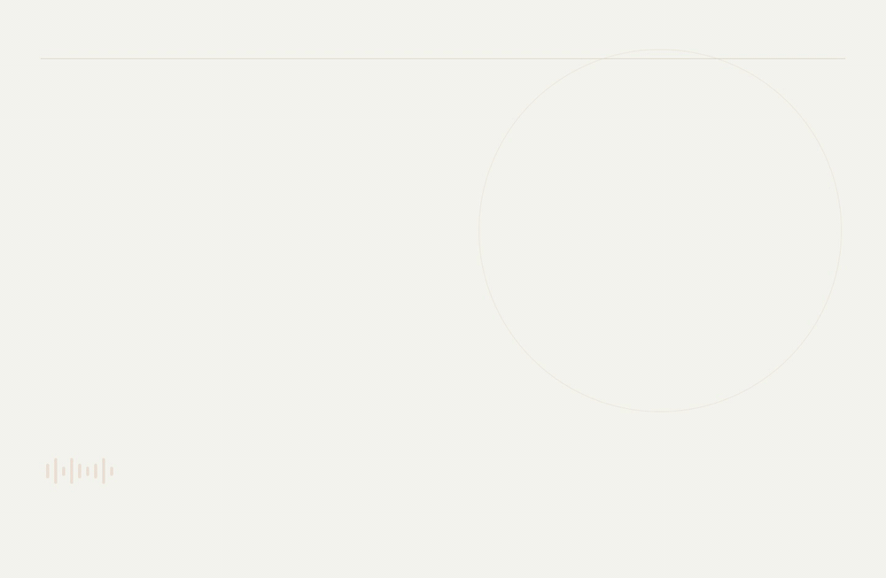

# Suno Save Assistant

[中文](README.md) · [Download](https://github.com/lhfer/suno-save-assistant/releases/latest) · [Interactive demo](https://lhfer.github.io/suno-save-assistant/)

A local-first Chrome extension for saving your own playable Suno songs. Click a save button or paste a song link; the extension queues the task, collects the normal playback buffer, validates the complete audio, and saves automatically.



The animation uses fictional data and compressed timing. It is an interaction illustration, not a live download recording.

## Install

1. Download the extension ZIP from [Releases](https://github.com/lhfer/suno-save-assistant/releases/latest), then extract it into a permanent folder.
2. Visit `chrome://extensions`, enable Developer mode, select **Load unpacked**, and choose the folder containing `manifest.json`. From a source checkout, choose `extension/`.
3. Refresh Suno and click the save button beside your own song. Disable older installations first.

Requires Chrome 120+. No build step or account registration is needed.

## Features

- Song-list button, paste-to-save, current-song action, context menu and `Alt/Option+Shift+S`.
- Silent task tabs, sequential queue and automatic downloads.
- Short and canonical links deduplicated by song identity; an existing saved file is reused.
- Persistent unfinished queue. Resume after a browser restart or extension reload; incomplete audio starts again from the beginning.
- Timeline, fragment and byte-size validation. A task is complete only after Chrome confirms the file.
- Local task history and metadata backups.

Chrome requires brief foreground initialization of the muted task tab. It then returns to the previous tab; it respects a user's manual tab switch.

## Scope

Uses the audio delivered to normal page playback. It does not call official export, billed download or WAV generation endpoints, extract playback keys, or bypass protected media. Use it for songs you own or are authorized to save and can normally play.

Output is an Opus audio track in an M4A container, saved to `Suno/` inside the browser's default download directory. No transcoding or quality enhancement. Supports single-track fragmented MP4 up to 64 MiB.

There is no remote account service or analytics. Tasks remain local; exported metadata can contain private song links and local filenames. This is an independent project, not affiliated with Suno.

## Verification

71 automated regression tests. Four real files in one desktop Chrome acceptance run completed in 16.2, 25.8, 15.0 and 17.9 seconds, and all passed full audio decoding. This is measured evidence, not a performance guarantee. The public test fixture is a generated sine wave, never a private song. See [validation details](docs/VALIDATION.md).

## Development

```sh
npm test
npm run check
npm run package
```

Tests require Node.js 20+. Packaging needs Python 3. See [CONTRIBUTING.md](CONTRIBUTING.md).
