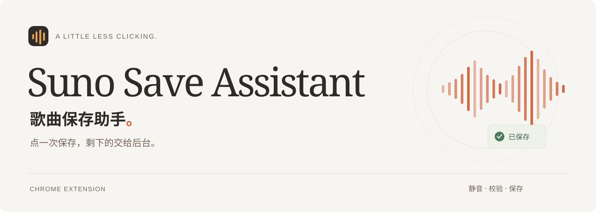

<p align="center">
  
</p>

<p align="center">
  <a href="https://github.com/lhfer/suno-save-assistant/releases/latest"></a>
  <a href="https://github.com/lhfer/suno-save-assistant/actions/workflows/ci.yml"></a>
  
  <a href="LICENSE"></a>
</p>

<p align="center">
  <b>把自己的 Suno 歌曲，保存到本地。</b><br>
  点一次或粘贴一次，静音后台处理，检查完整后自动保存。
</p>

<p align="center">
  <a href="https://github.com/lhfer/suno-save-assistant/releases/latest">下载扩展</a> ·
  <a href="https://lhfer.github.io/suno-save-assistant/">体验交互演示</a> ·
  <a href="docs/guides/INSTALL.md">安装指南</a> ·
  <a href="README.en.md">English</a>
</p>

## 从一条链接，到本地文件


*流程示意使用虚构歌名与压缩时间，不是真实下载录屏。真实验收数据见下文。* [高清 MP4](docs/assets/save-flow.mp4)

## 少点几次，安心保存

| 你要做的 | 插件接下来的工作 |
| --- | --- |
| 在歌曲旁点「保存」，或粘贴链接 | 自动排队、启动、检查、下载 |
| 继续做其他事 | 初始化时短暂显示静音任务页，随后自动返回 |
| 再次提交同一首歌 | 合并短链与长链，复用仍存在的文件 |
| 重开 Chrome 或更新插件 | 找回未完成任务，点击继续后从头重新采集 |

还有右键保存、保存当前歌曲、`Option/Alt+Shift+S` 快捷键和任务记录备份。

## 安装，三步就好

1. 从 [Releases](https://github.com/lhfer/suno-save-assistant/releases/latest) 下载 `suno-save-assistant-v0.3.0.zip`，解压到长期保留的文件夹。
2. 打开 `chrome://extensions`，启用「开发者模式」，点击「加载已解压的扩展程序」，选择包含 `manifest.json` 的文件夹。
3. 刷新 Suno，在自己的歌曲旁点 **↓ 保存**。

从源码安装时请选择仓库中的 `extension/`。已经装了旧版，请先停用旧版，避免同时运行两份。[详细安装与更新说明 →](docs/guides/INSTALL.md)

## 完整保存，有实际验证

0.3.0 的一次桌面 Chrome 验收中，4 首约 3 分钟的歌曲分别用时 **16.2 / 25.8 / 15.0 / 17.9 秒**完成保存，均通过片段连续性、文件大小与全长音频解码检查。

- **71 项自动化回归测试**：队列、恢复、去重、取消、焦点保护、残缺文件拒绝等。
- **4 个真实音频文件**：单首保存、两首恢复队列、分享短链；全部完整解码。
- **发布包与个人数据分离**：公开测试仅使用生成的正弦波，不含真实歌曲、账号或保存记录。

这些是一次验收的结果，耗时会随歌曲、网络和网页状态变化。[完整验收范围与限制 →](docs/VALIDATION.md)

## 它如何工作

使用 Suno 页面正常播放时的音频缓冲区，检查媒体片段和完整时长，再交给 Chrome 下载管理器保存。**不调用官方导出、下载计费或 WAV 生成接口。**

输出位于浏览器默认下载目录的 `Suno/` 子文件夹，为 M4A 容器中的 Opus 音频。项目不做音质提升或 MP3 转码，也不提取播放密钥。

<details>
<summary><b>使用前需要知道什么？</b></summary>

- 适用于你拥有或有权保存、且在网页上能正常播放的歌曲。
- 为让 Chrome 初始化音频，任务页会短暂显示，然后自动回到后台。系统休眠时不能保证定时器准点执行。
- 保持 Chrome 打开。恢复任务会从头采集；不是音频断点续传。
- 支持 Chrome 120+ 中的单音轨 fragmented MP4 / M4A，音频上限 64 MiB。
- 网站变更、媒体保护或格式不支持可能导致明确失败；不会用残缺文件冒充成功。
- 这是独立项目，与 Suno 官方无关联。

</details>

<details>
<summary><b>权限和隐私</b></summary>

网站权限仅为 `https://suno.com/*`。`activeTab` 与 `scripting` 用于歌曲识别及任务页，`storage` 保存本机任务，`downloads` 保存文件并核验已记录的下载 ID，`alarms` 做恢复检查，`contextMenus` 添加右键入口。

没有账号后端、分析埋点或遥测上传。任务记录仅保存在本机；导出的 JSON 可能包含私人歌曲链接与本机文件路径，请勿直接贴进公开 Issue。

</details>

## 开发与贡献

```sh
npm test          # 无运行时依赖，Node.js 20+
npm run check    # 语法、权限、发布内容检查
npm run package  # Python 3，生成 dist/ 下的 ZIP 与 SHA256SUMS
```

`extension/` 是扩展源码，`docs/` 是静态演示站，`media/` 是动图源文件。欢迎提交可复现的问题或改进，见 [贡献指南](CONTRIBUTING.md)。

## 许可证

采用 [MIT License](LICENSE)。
